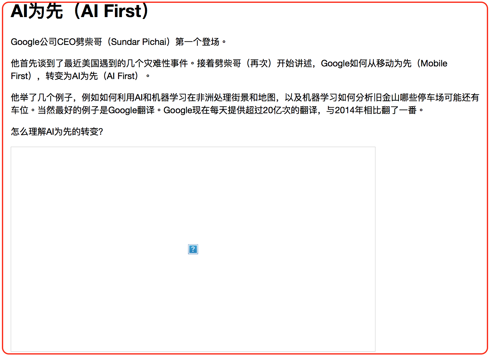
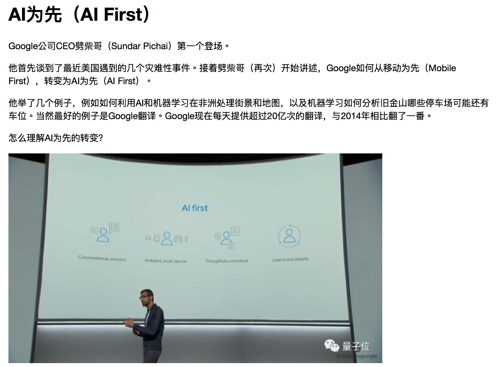

# 将微信公众号中的webp图片替换成常规格式

Evernote是我们常用的资料管理工具，微信公众号是一个重要的信息来源。当Evernote遇到微信公众号的时候，问题来了。微信公众号的图片格式大多是webp的，[例子](https://mp.weixin.qq.com/s/WPioQ_dnOBSDxWRv41ZXjA)，Evernote并不支持展示webp，而[过了两年似乎并没有要添加这个feature的意思](https://discussion.evernote.com/topic/85241-evernote-doesnt-support-webp-image/)。实在忍受不了继续等这个feature了，不如自己动手。

## 治疗前



## 治疗后



## 原理

对微信公众号的页面处理很简单。图片的`data-src`里面写的是传统格式，如jpeg，替换到`src`里面即可。

例如。替换前：

```

```

替换后：

```

```